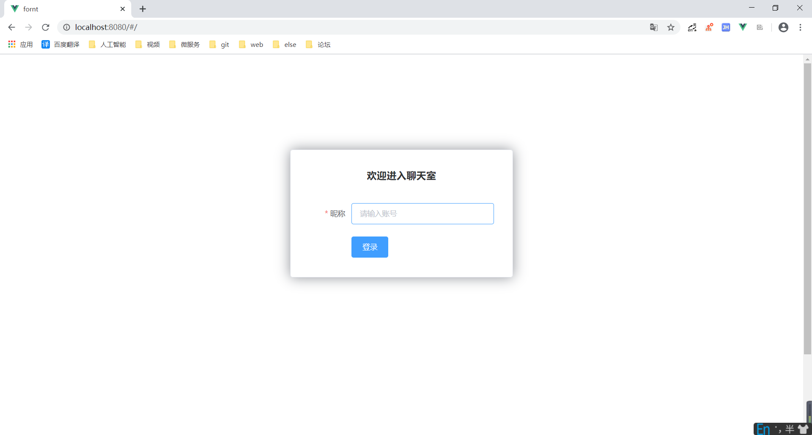
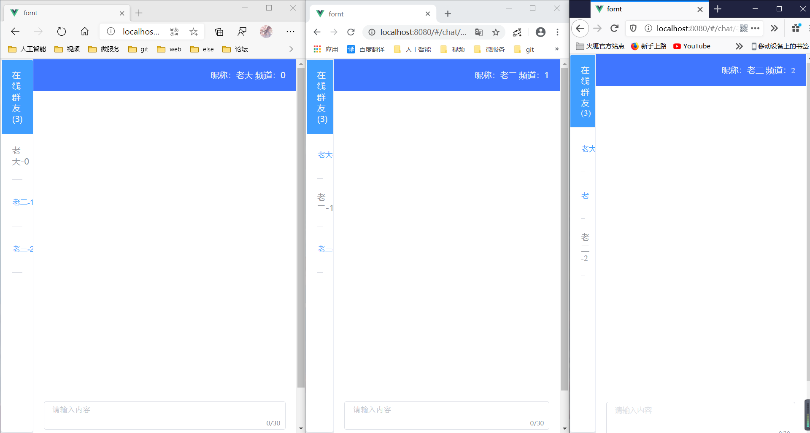
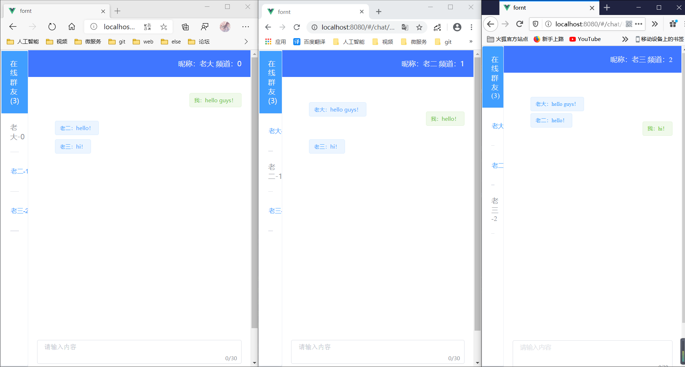
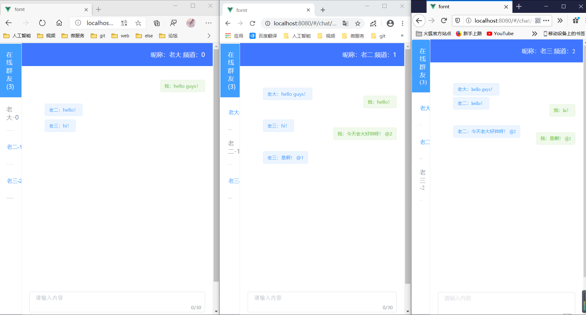
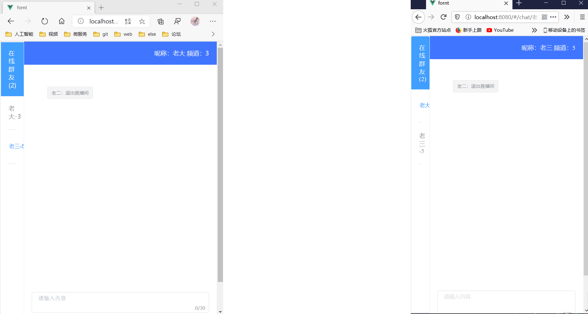

# 聊天室项目

## V1版
> 练习websocket+vue+elementUI和git

#### master创建
完成把项目想到v1版，然后删除backstage与fornt分支

#### backstage创建
完成后台
修改后台关闭连接时发送消息的错误

#### fornt创建
完成前台
做了一些小更改
可以点击进行“@”，优化显示在线成员，显示成员退出直播间的消息

#### 展示
登录

聊天室（三种浏览器里的展示）

群聊

私聊

成员退出
